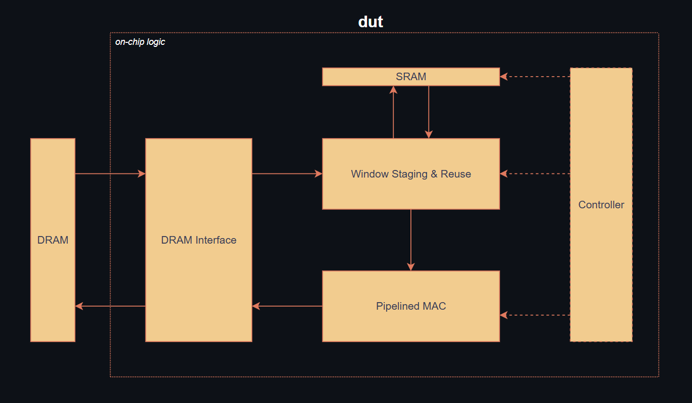

# Hardware CNN Pipeline
**Streaming convolution accelerator demonstrating RTL design, synthesis analysis, and performance-per-area optimization**

Configurable 4×4 convolution pipeline operating on 1024×1024 image inputs with DRAM input/output, SRAM buffering, and pipelined MAC computation.

---

## Overview

This project implements a hardware convolutional neural network (CNN) pipeline designed to explore **dataflow-driven accelerator design** rather than software-level neural network modeling.

The primary goals of the project are to: 
- Optimize RTL design choices to improve performance and resource efficiency
- Use synthesis results to evaluate timing and area tradeoffs
- Iteratively refine the design based on synthesis insights
- Integrate on-chip and off-chip memory resources as part of a structured memory subsystem

The primary goals of the RTL design are to: 
- Sustain high throughput through a pipelined, streaming datapath
- Minimize area by limiting on-chip storage and carefully sizing buffers
- Limit external memory traffic via on-chip buffering and data reuse
- Integrate SRAM and DRAM through a clearly defined memory interface
- Enforce strict modularity to enable efficient synthesis, verification, and iterative optimization
  
This repository is intended for **technical review by hardware and systems engineers**, not as a deployable end-user application. 

---

## Repository Structure
```markdown
├── Results – Timing and Cell reports from synthesization
├── Vivado-Testing – Module-level source code and tailored testbenches
├── projectFall2025.v3 – Provided project structure
├── dut_rtl – RTL scripts for all levels of pipelining
└── README.md

```

---

## RTL Organization and Dataflow
<p align="center">
  
</p>


### DRAM (off-chip)
External DRAM serves as bulk storage for input feature maps and output results and is accessed through aligned burst transactions.

### DRAM Interface
The DRAM interface manages burst-based reads and writes to external memory and presents a streaming data interface to the on-chip logic. It decouples external memory timing from the internal datapath.

### SRAM (Scratchpad)
On-chip SRAM acts as a managed scratchpad to buffer input data and enable reuse across overlapping convolution windows. This reduces repeated DRAM accesses and improves effective bandwidth utilization.

### Window Staging & Reuse
The window staging unit constructs sliding convolution windows from buffered input data and maintains reuse across spatially adjacent windows. It feeds windowed data to the compute pipeline using a refill-and-stream buffering scheme.

### Pipelined MAC
The pipelined MAC datapath performs multiply–accumulate operations over staged convolution windows and represents the critical compute path of the design. The pipeline depth was explored and optimized to balance throughput and area.

### Controller
A centralized controller sequences memory transactions, window advancement, and compute progression. Control is distributed internally across multiple FSMs but appears as a single supervisory entity at the architectural level.


---

## Key Architectural Decisions

### Sliding Window via Shift Registers
- **Options considered:** Re-reading from SRAM vs explicit window buffering  
- **Chosen approach:** Shift-register-based window staging  
- **Rationale:** Enables deterministic reuse and sustained throughput with minimal control complexity  

### SRAM as a Scratchpad Buffer
- **Options considered:** Direct DRAM streaming vs intermediate SRAM scratchpad  
- **Chosen approach:** SRAM scratchpad  
- **Rationale:** Decouples compute from DRAM latency and enables burst-aligned accesses  

### Fully Streaming Pipeline
- **Options considered:** Batch-style processing vs streaming  
- **Chosen approach:** Streaming pipeline after initial fill  
- **Rationale:** Maximizes hardware utilization and simplifies steady-state control  

---

## Known Limitations

- Single-channel processing: The design performs spatial convolution on a single input feature map and does not accumulate contributions across multiple input channels.
- Memory bandwidth bound: End-to-end throughput is primarily limited by external DRAM read and write bandwidth rather than compute capacity.
- Fixed configuration: Kernel dimensions and input feature map size are fixed at synthesis time and are not dynamically configurable.
- SRAM-dependent buffering: Intermediate buffering and register-file behavior are constrained by SRAM access width and read/write scheduling.

These limitations were accepted to keep the design analyzable and verifiable.

---

## Results and Current Status

The MAC unit was identified as the critical path of the design. To explore the performance–area tradeoff, multiple pipeline depths were synthesized and evaluated using post-synthesis timing and area reports from Synopsys.

Three configurations were analyzed: a purely combinational MAC, a moderately pipelined MAC, and a deeply pipelined MAC. Performance is evaluated as maximum achievable clock frequency normalized by synthesized standard-cell area.

| Configuration | Pipeline Stages | Area (µm²) | Clock Period (ns) | Frequency (MHz) | Performance / Area | Δ Perf/Area vs Previous |
|---------------|------------------|------------|-------------------|------------------|--------------------|--------------------------|
| dut_0stage    | 0                | 17,400.66  | 6.36              | 157.2            | 9.03               | —                        |
| dut_2stage    | 2                | 17,632.61  | 4.00              | 250.0            | 14.18              | +57.0%                   |
| dut_4stage    | 4                | 21,640.70  | 3.40              | 294.1            | 13.49              | −4.9%                    |

While deeper pipelining improves maximum clock frequency, the associated increase in register and control logic introduces diminishing returns in terms of performance per area. The two-stage pipelined configuration provides the best balance, achieving the highest normalized throughput with only a modest area increase relative to the unpipelined design.

Based on this analysis, the two-stage pipelined MAC was selected for integration into the full CNN datapath.


---

## Future Work

#### Intermediate buffer resizing for area efficiency:
The current design stages data by copying an 8×8 buffer into a 4×12 intermediate buffer to support sliding-window access. This buffering strategy can be reduced to a 4×8 and 8×8 configuration, respectively, with minimal changes to control sequencing. Doing so would reduce on-chip storage requirements while preserving functional behavior.

#### Activation and pooling integration:
Leaky ReLU and pooling stages are not currently implemented, as they were not required by the ECE 464 course specification. Extending the pipeline to include these stages would require controller restructuring, additional buffering, and the introduction of properly pipelined arithmetic logic to maintain streaming throughput across the full CNN datapath.

#### Simplified DRAM ingress and egress handling:
The current DRAM interface reads data starting from the earliest memory address and subsequently reorders the stream to accommodate MSB-first protocol behavior, resulting in additional buffering and latency. An alternative access strategy that begins reads from the latest memory location would preserve correct ordering while eliminating the need for flip registers, simplifying control logic and reducing latency.

#### Alternative SRAM access patterns for improved reuse:
The current SRAM organization snapshots four complete rows of the input feature map and performs row-wise writes. An alternative column-wise write and access pattern, while less intuitive, could reduce SRAM read/write operations and enable smaller intermediate buffers. This approach would lower latency and area usage at the cost of more complex controller and buffer logic.

---

